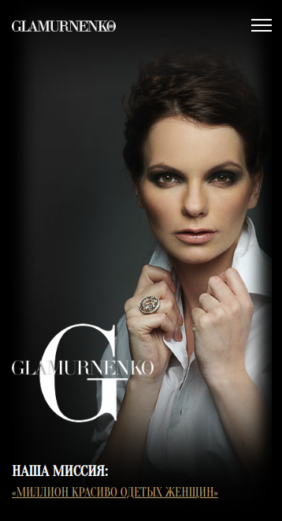

# GLAMURNENKO

---

## Задача:
- Сверстать адаптивный сайт с использованием css-фреймворка bootstrap-4.
- Для картинок создать галерею используя <a href="https://fancyapps.com/fancybox/3/">fancybox</a>.
- В качестве макета использовать <a href="https://disk.yandex.ru/i/JO4pmP9aTBcRSg">изображение</a>.
- Меню навигации после прокрутки первого экрана должно прикрепиться к верху окна.

## Инструменты:
    
## Результат:

 
Итоговый результат можно увидеть по данной <a href="https://brahner.github.io/glamurnenko/">ссылке</a>
